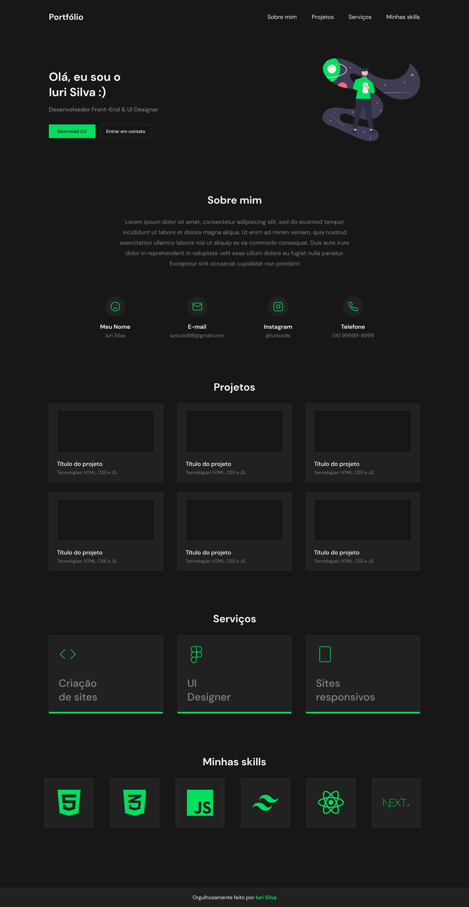

# Projeto 1 - Portfolio
## Introdução
Esta atividade deverá ser entregue individualmente. 
Para realizar a entrega do projeto, o aluno deverá postar o link do seu Github pessoal contendo o repositório do projeto e o link do Deploy.
## Instruções
Essa imagem é uma referência para você construir seu portfólio.

Os itens básicos que você precisa adicionar em seu projeto são:
<ul>
  <li>Menu;</li>
  <li>Header se apresentando;</li>
  <li>Section com um “sobre mim” mais detalhado;</li>
  <li>Section com detalhes de contato;</li>
  <li>Section com seus projetos (podem ser os feitos no M01);</li>
  <li>Section com as tecnologias que você domina(pode adicionar HTML, CSS e JS);</li>
  <li>Footer falando quem fez o site.</li>
</ul>
